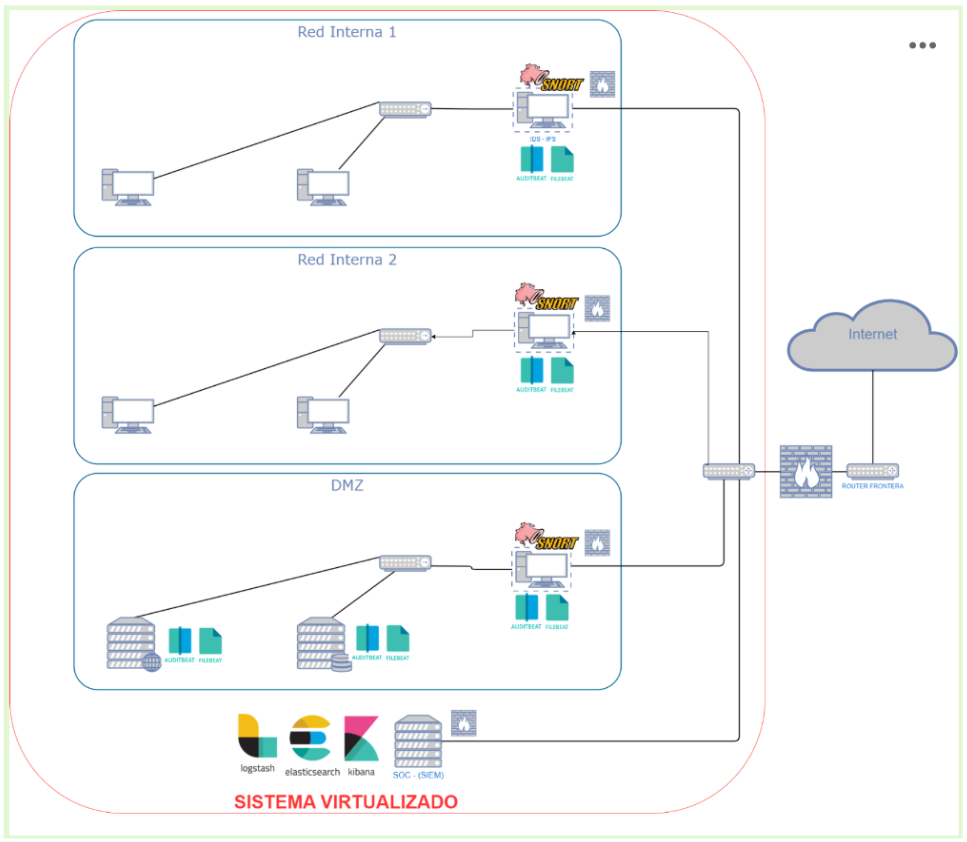
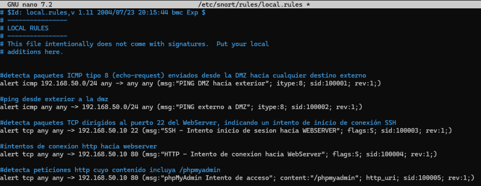
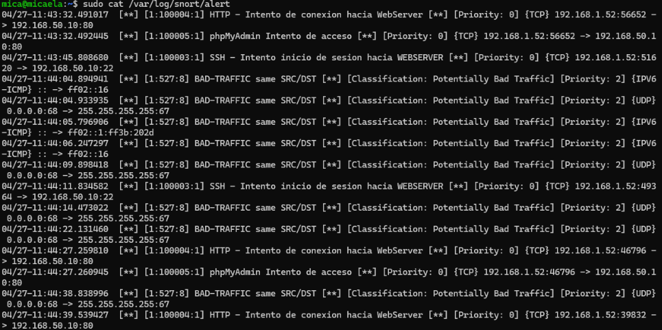

```text
███████╗███╗   ██╗ ██████╗ ██████╗ ████████╗     ██╗██████╗ ███████╗
██╔════╝████╗  ██║██╔═══██╗██╔══██╗╚══██╔══╝     ██║██╔══██╗██╔════╝
███████╗██╔██╗ ██║██║   ██║██████╔╝   ██║        ██║██║  ██║███████╗
╚════██║██║╚██╗██║██║   ██║██╔══██╗   ██║        ██║██║  ██║╚════██║
███████║██║ ╚████║╚██████╔╝██║  ██║   ██║        ██║██████╔╝███████║
╚══════╝╚═╝  ╚═══╝ ╚═════╝ ╚═╝  ╚═╝   ╚═╝        ╚═╝╚═════╝ ╚══════╝

DMZ Security Lab · Snort IDS · Blue Team · Network Monitoring
```

# Snort IDS DMZ Security Lab


Laboratorio de ciberseguridad defensiva basado en **Snort IDS**, segmentación de red y una arquitectura con **DMZ**, diseñado para detectar tráfico sospechoso y analizar alertas generadas en un entorno controlado.

Este proyecto forma parte de mi portfolio de ciberseguridad y está orientado a demostrar conocimientos prácticos de redes, monitorización, IDS, análisis de tráfico y fundamentos de Blue Team.

---

> [!NOTE]
> Este laboratorio se realizó en un entorno controlado y con fines educativos.  
> El objetivo no es explotar sistemas reales, sino entender cómo se puede diseñar una arquitectura defensiva básica y cómo un IDS como Snort ayuda a detectar actividad sospechosa dentro de una red.

---

# Descripción del proyecto

Este proyecto consiste en la creación de un laboratorio de seguridad donde se implementa una arquitectura de red segmentada con una zona **DMZ**, una red interna y una máquina de pruebas utilizada para generar tráfico.

La idea principal fue simular un entorno parecido al que podría existir en una empresa pequeña, donde ciertos servicios se ubican en una zona expuesta o separada de la red interna, y un IDS se encarga de monitorizar el tráfico para detectar posibles conexiones sospechosas, escaneos o intentos de acceso.

Durante el laboratorio se configuró **Snort** como sistema de detección de intrusiones, se crearon reglas básicas de detección y se realizaron pruebas de conectividad y generación de tráfico para comprobar que las alertas se producían correctamente.

El proyecto está enfocado principalmente en la parte defensiva: visibilidad de red, segmentación, detección de eventos y análisis básico de alertas.

---

# Objetivos del laboratorio

- Diseñar una arquitectura de red segmentada con una zona DMZ
- Configurar Snort como IDS dentro del entorno
- Crear reglas básicas de detección
- Generar tráfico de prueba desde una máquina atacante/controlada
- Detectar conexiones y eventos sospechosos
- Analizar alertas generadas por Snort
- Comprender la utilidad de una DMZ en una arquitectura defensiva
- Reforzar conocimientos de redes, Linux y Blue Team

---

# Tecnologías utilizadas

| Tecnología | Uso dentro del laboratorio |
|---|---|
| Snort | Sistema IDS para detección de tráfico sospechoso |
| Ubuntu Server | Máquina defensiva/servidor del laboratorio |
| Kali Linux | Máquina de pruebas para generar tráfico |
| Linux | Administración del entorno y servicios |
| TCP/IP | Comunicación y análisis de red |
| VirtualBox | Virtualización del laboratorio |
| Nmap | Pruebas de escaneo controladas |
| Wireshark | Apoyo en análisis de tráfico |
| UFW/iptables | Reglas básicas de filtrado |

---

# Arquitectura del laboratorio

La arquitectura está formada por varias máquinas virtuales conectadas mediante redes internas. El objetivo fue separar los servicios y simular una zona DMZ monitorizada por Snort.

| Zona | Máquina | Función |
|---|---|---|
| Red externa / pruebas | Kali Linux | Generación de tráfico y pruebas controladas |
| DMZ | Servidor Ubuntu | Servicio expuesto o máquina monitorizada |
| Seguridad | Snort IDS | Monitorización y detección de tráfico |
| Red interna | Cliente/Servidor interno | Segmento protegido del laboratorio |

> [!TIP]
> La DMZ permite separar servicios que pueden recibir conexiones desde zonas menos confiables, evitando que un posible compromiso afecte directamente a la red interna.

Cuando añadas la imagen de arquitectura, usa este formato:

```md

```

---

# Flujo de funcionamiento

El flujo básico del laboratorio fue el siguiente:

1. La máquina Kali genera tráfico de prueba hacia la DMZ
2. El tráfico atraviesa la red configurada en el laboratorio
3. Snort monitoriza la interfaz correspondiente
4. Las reglas de Snort analizan el tráfico recibido
5. Si el tráfico coincide con una regla, se genera una alerta
6. Las alertas se revisan desde consola o desde los logs de Snort
7. Se analiza qué tipo de evento se ha producido y por qué ha sido detectado

---

# Qué detecta el laboratorio

| Evento | Descripción | Herramienta |
|---|---|---|
| ICMP | Detección de paquetes ping | Snort |
| SSH | Detección de conexiones al puerto 22 | Snort |
| HTTP | Detección de tráfico web | Snort |
| Escaneo de puertos | Identificación de actividad de reconocimiento | Nmap + Snort |
| Tráfico hacia DMZ | Monitorización de conexiones hacia zona expuesta | Snort |

---

# Implementación

## 1. Configuración de red

Se configuraron las máquinas virtuales en redes separadas para simular una arquitectura con segmentación. Esta parte es importante porque una DMZ tiene sentido cuando existe separación entre zonas y no todo el tráfico circula libremente por la misma red.

Captura recomendada:

```md

```

---

## 2. Instalación de Snort

Snort se instaló en la máquina encargada de monitorizar el tráfico de red.

```bash
sudo apt update
sudo apt install snort -y
```

Después de la instalación, se comprobó que Snort estuviera disponible:

```bash
snort -V
```

---

## 3. Configuración de reglas IDS

Las reglas locales se configuraron en:

```bash
/etc/snort/rules/local.rules
```

Ejemplo de reglas utilizadas:

```conf
alert icmp any any -> any any (msg:"ICMP Packet Detected"; sid:1000001; rev:1;)
alert tcp any any -> any 22 (msg:"SSH Connection Detected"; sid:1000002; rev:1;)
alert tcp any any -> any 80 (msg:"HTTP Traffic Detected"; sid:1000003; rev:1;)
```

Captura recomendada:

```md

```

---

## 4. Ejecución de Snort

Snort se ejecutó en modo IDS indicando la interfaz de red que se quería monitorizar:

```bash
sudo snort -A console -q -c /etc/snort/snort.conf -i enp0s3
```

Donde:

- `-A console` muestra las alertas directamente en consola
- `-q` reduce la salida innecesaria
- `-c` indica el archivo de configuración
- `-i` indica la interfaz de red monitorizada

> [!IMPORTANT]
> La interfaz `enp0s3` puede cambiar según la máquina virtual. Antes de ejecutar Snort es importante comprobar la interfaz correcta con `ip a`.

---

## 5. Generación de tráfico de prueba

Desde Kali se generó tráfico controlado para comprobar si Snort detectaba correctamente los eventos.

Ejemplo de ping:

```bash
ping 192.168.56.20
```

Ejemplo de escaneo básico:

```bash
nmap -sS 192.168.56.20
```

Ejemplo de conexión SSH:

```bash
ssh usuario@192.168.56.20
```

---

## 6. Análisis de alertas

Las alertas generadas por Snort permitieron comprobar que las reglas estaban funcionando correctamente y que el IDS era capaz de detectar eventos concretos dentro del laboratorio.

Captura recomendada:

```md

```

También se pueden revisar logs en:

```bash
/var/log/snort/
```

---

# Capturas recomendadas

| Imagen | Qué debería mostrar |
|---|---|
| `01-network-topology.png` | Esquema completo de red con DMZ |
| `02-network-config.png` | Configuración IP de las máquinas |
| `03-snort-rules.png` | Reglas IDS configuradas |
| `04-snort-alerts.png` | Alertas generadas por Snort |
| `05-nmap-scan.png` | Escaneo controlado desde Kali |
| `06-icmp-detection.png` | Detección de tráfico ICMP |
| `07-ssh-detection.png` | Detección de conexión SSH |
| `08-logs-review.png` | Revisión de logs generados |

---

# Resultados obtenidos

El laboratorio permitió comprobar cómo un IDS puede detectar tráfico dentro de una red segmentada y generar alertas en función de reglas previamente definidas.

Durante las pruebas se detectaron eventos relacionados con tráfico ICMP, conexiones SSH, tráfico HTTP y escaneos básicos realizados desde Kali. Esto permitió entender mejor cómo Snort analiza paquetes de red y cómo las reglas IDS permiten identificar patrones concretos.

Además, la parte de DMZ ayudó a comprender la importancia de separar zonas dentro de una red, especialmente cuando existen servicios que podrían estar más expuestos. Esta separación permite reducir el impacto de posibles incidentes y mejorar la visibilidad del tráfico que entra o sale de una zona concreta.

---

# Skills demonstrated

- Configuración básica de Snort IDS
- Diseño de arquitectura con DMZ
- Segmentación de red
- Análisis de tráfico
- Detección de eventos sospechosos
- Administración Linux
- Uso básico de Nmap
- Revisión de logs
- Fundamentos Blue Team
- Monitorización defensiva

---

# Estructura del repositorio

```bash
snort-ids-dmz-security-lab/
│
├── README.md
│
├── docs/
│   ├── full-documentation.md
│   └── informe-original.pdf
│
├── images/
│   ├── 01-network-topology.png
│   ├── 02-network-config.png
│   ├── 03-snort-rules.png
│   └── 04-snort-alerts.png
│
├── configs/
│   ├── snort.conf
│   ├── local.rules
│   ├── network-notes.md
│   └── dmz-topology.md
│
└── notes/
    ├── commands.md
    └── troubleshooting.md
```

---

# Documentación completa

La explicación técnica paso a paso se encuentra en:

[Ver documentación completa](docs/full-documentation.md)

---

# Notas importantes

> [!CAUTION]
> Las pruebas realizadas en este laboratorio se han ejecutado únicamente en un entorno controlado.  
> Las técnicas de escaneo o generación de tráfico deben realizarse solo sobre sistemas propios, autorizados o preparados para prácticas.

> [!TIP]
> Este proyecto está pensado como práctica defensiva. Aunque se utiliza Kali para generar tráfico, el foco principal está en la detección, monitorización y análisis desde el punto de vista Blue Team.

---

# Autor

Proyecto desarrollado como laboratorio práctico de ciberseguridad orientado a redes, DMZ, detección de intrusiones y monitorización defensiva con Snort IDS.
